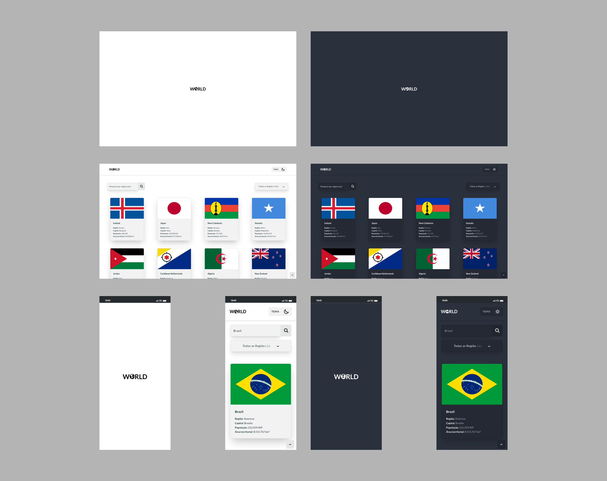

<h2 align="center">API Paises </h2>

 

Projeto construído com uma API para resgatar os dados de 250 países, podendo filtrar por região: África, Américas, Ásia, Europa e Oceânia.

  

  

## ⚡ Mais sobre o projeto:
- Loader de início no site.
- 2 temas (claro e escuro).
- Campo para pesquisar por um país.
- Filtrar por região.

 

## ⚡ API:
- API com 250 países.
- África: 59 países.
- Américas: 56 países.
- Ásia: 50 países.
- Europa: 53 países.
- Oceânia: 27 países.
- Outros: 5 países

- LINK DA API: https://restcountries.com/

 

## 🔧 Tecnologias:
- VueJS
- Javascript
- Tailwind

 

## 📍 DEPLOY :
- <a href="">CLIQUE AQUI PARA VER O PROJETO</a>

 

## 🧠 Autor

- [@paulopariz](https://paulopariz.vercel.app/)

  

<h2 align="center">Contato:</h2>

    

 
